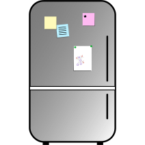

# kitchen-fridge

kitchen-fridge is a CalDAV (iCal file transfer over WebDAV) Rust client library.

CalDAV is described as "Calendaring Extensions to WebDAV" in [RFC 4791](https://datatracker.ietf.org/doc/html/rfc4791) and [RFC 7986](https://datatracker.ietf.org/doc/html/rfc7986) and the underlying iCal format is described at least in [RFC 5545](https://datatracker.ietf.org/doc/html/rfc5545). \
This library has been intensivley tested with Nextcloud servers. It should support Owncloud and iCloud as well, since they use the very same CalDAV protocol.

Its [documentation](https://docs.rs/kitchen-fridge/) is available on docs.rs.

CalDAV is described as "Calendaring Extensions to WebDAV" in [RFC 4791](https://datatracker.ietf.org/doc/html/rfc4791) and [RFC 7986](https://datatracker.ietf.org/doc/html/rfc7986) and the underlying iCal format is described at least in [RFC 5545](https://datatracker.ietf.org/doc/html/rfc5545).
